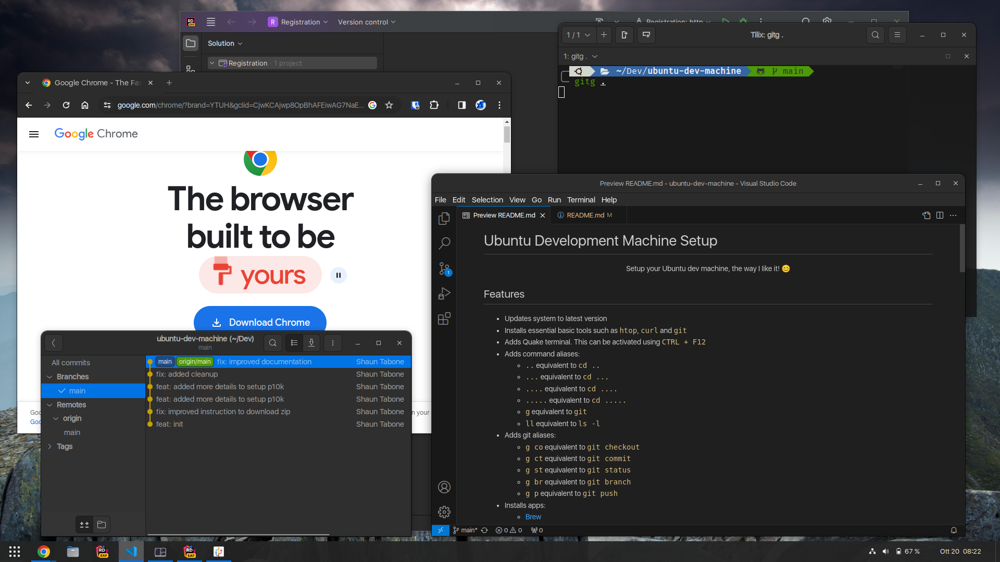
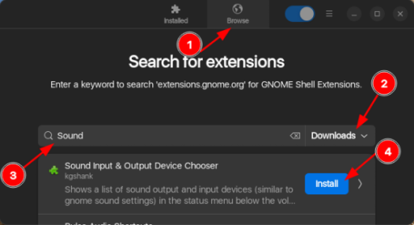
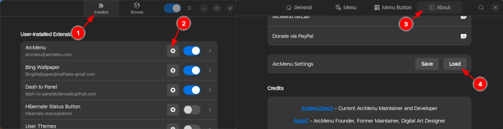
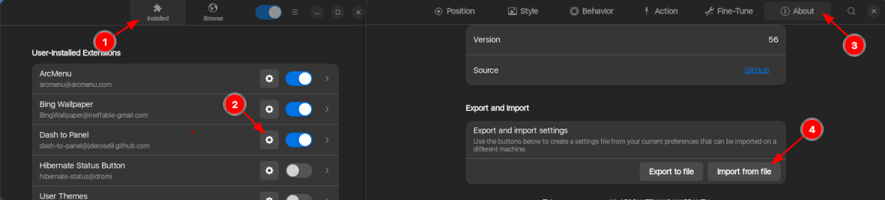

# Ubuntu Development Machine Setup

<a href="screenshots/desktop.png"><p align="center"></p></a>
*<p align="center">"Setup your Ubuntu dev machine, the way I like it! 😊"</p>*

## Features

* Updates system to latest version (DEB and Snap).
* Installs essential basic tools such as `htop`, `btop`, `curl`, `git`, `neovim` and `tldr`.
* Adds Quake terminal.  This can be activated using `CTRL + F12`.
* Adds command aliases:
    * `..` equivalent to `cd ..`
    * `...` equivalent to `cd ...`
    * `....` equivalent to `cd ....`
    * `.....` equivalent to `cd .....`
    * `g` equivalent to `git`
    * `ll` equivalent to `ls -l`
* Adds git aliases:
    * `g co` equivalent to `git checkout`
    * `g ct` equivalent to `git commit`
    * `g st` equivalent to `git status`
    * `g br` equivalent to `git branch`
    * `g p` equivalent to `git push`
* Installs apps:
    * [Brew](https://brew.sh/)
    * [Docker](https://www.docker.com/)
    * [.NET 7 + 8](https://dotnet.microsoft.com/)
    * [Gitg](https://github.com/GNOME/gitg)
    * [Google Chrome](https://www.google.com/chrome/)
    * [Oh My Zsh](https://ohmyz.sh/) including plugins
    * [Rider](https://www.jetbrains.com/rider/)
    * [Tilix](https://gnunn1.github.io/tilix-web/)
    * [Visual Studio Code](https://code.visualstudio.com/)
* Installs fonts:
    * [Nerd Font](https://www.nerdfonts.com/)
    * [SF UI Font](https://developer.apple.com/fonts/)

## Getting Started

1. Open link to [Download ZIP](https://github.com/xontab/ubuntu-dev-machine/archive/refs/heads/main.zip).

1. Extract ZIP file.

1. Open extracted `ubuntu-dev-machine-main` folder.

1. Right click and `Open in Terminal`.

## Development Setup

1. Run the following command:
    ```sh
    bash install.run
    ```
1. Select the items that you wish to install.  Use `Space` button to tick/untick the options. Then use `Tab` and `Enter` to confirm selection.

1. In the next screen, confirm that the variables are correct.  Press `Enter` to proceed.

1. After the installation is completed, click on the `Enter` button to restart.

## Windows-like UI

### Extensions

1. Open the Terminal.

1. Run the following commands:
    ```sh
    sudo apt update
    sudo apt install gnome-shell-extension-manager -y
    extension-manager
    ```

1. Click on `Browse` and `Install` the following extensions as illustrated below:
<a href="screenshots/extensions.png"><p align="center"></p></a>
    *  **ArcMenu** (Tip: use search keyword `ArcMenu` and sort by `Downloads`)
    *  **Dash to Panel** (Tip: use search keyword `Panel` and sort by `Downloads`)
    *  **Sound Input & Output Device Chooser** (Tip: use search keyword `Sound` and sort by `Downloads`)


#### ArcMenu

This extension is used to setup the Start menu similar to Windows.  Follow the instructions below to configure:

<a href="screenshots/arcmenu.png"><p align="center"></p></a>

1. Go to the `Installed` tab.

1. Click on ⚙️ to configure `ArcMenu`.

1. Switch to `About` tab.

1. Click on `Load` and choose [extensions/ArcMenu](./extensions/ArcMenu) configuration file from extracted folder.

#### Dash to Panel

This extension is used to setup the Taskbar similar to Windows.  Follow the instructions below to configure:

<a href="screenshots/dashtopanel.png"><p align="center"></p></a>

1. Go to the `Installed` tab.

1. Click on ⚙️ to configure `Dash to Panel`.

1. Switch to `About` tab.

1. Click on `Import from file` and choose [extensions/DashToPanel](./extensions/DashToPanel) configuration file from extracted folder.

### Powerlevel10k configuration (optional)

1. Open the Terminal.

1. If you want to reconfigure Powerlevel10k, use the following command:
    ```sh
    p10k configure
    ``` 

